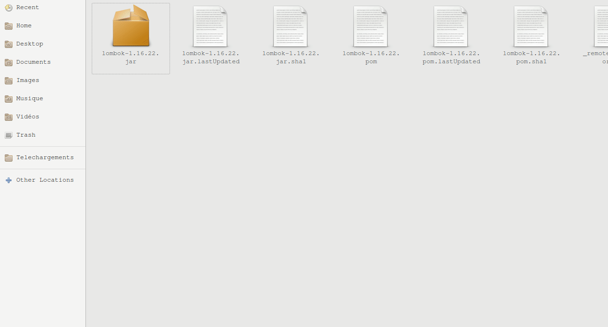

# RideForce User Service

This service handles the following endpoints (see the API documentation in
the gateway service repo for all endpoints and their explanations):

- `/registration-key`
- `/login`
- `/users`
- `/offices`
- `/cars`
- `/contact-info`
- `/roles`
- `/contact-types`

## Environment variables

Environment variables are used for sensitive data that should not be exposed
in the public Git repository. The following is a comprehensive list of all
environment variables that are necessary for proper program execution:

- `JDBC_URL`: the database url
- `JDBC_USERNAME`: the database username
- `JDBC_PASSWORD`: the database password

## Logging
Logging is done by logback, through the slfj interface. [lombok](https://projectlombok.org/download) dependency is required to use `@Slf4j`, which reduces code duplication.
```diff
+ import lombok.extern.slf4j.Slf4j;
...
+ @Slf4j
  public class SomeClass {
-   static final Logger log = LoggerFactory.getLogger(MethodHandles.lookup().lookupClass());
```
`@Slf4j` implicitly declares a variable named `log` of type `Logger`. `log` is initialized using logback's `LoggerFactory` and takes as its name the fully qualified name (package + class name) of the class in which it is declared. 

### Lombok & Spring Tool Suite
Spring Tool Suite does not automatically recognize the lombok annotation and will have Sonar Lint flag it as an error. To install lombok, locate the jar (in your .m2 folder or by downloading it from the link above). Execute by double clicking or with the command `java -jar lombok.jar`. In the wizard, locate the STS executable and hit install. If on Windows, run as administrator if necessary. Open `CMD` as administrator and run lombok as a jar:
```bash
java -jar path/to/lombok.jar
```

Lombok was not tested on MacOS.


