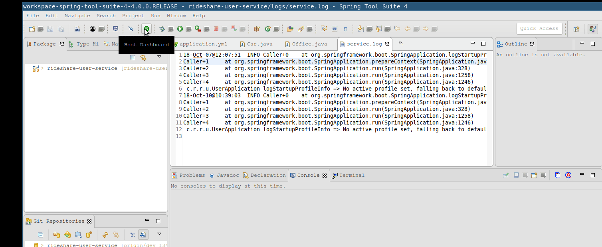

# RideForce User Service

This service handles the following endpoints (see the API documentation in the gateway service repo for all endpoints and their explanations):

- `/registration-key`
- `/login`
- `/users`
- `/offices`
- `/cars`
- `/contact-info`
- `/roles`
- `/contact-types`

## Configuring the database
Set the following environment variables are used for data that should not be exposed in the public Git repository. 

- `JDBC_URL`: *the database url*
- `JDBC_USERNAME`: *the database username*
- `JDBC_PASSWORD`: *the database password*
- `ACCESS`: *access key* (to access AWS S3 Bucket)
- `SECRET`: *secret key* (to access AWS S3 Bucket)

Spring Tool Suite can contain its own environment variables. To do this, go to the run menu and select `Run Configurations...`. Look for your project in the left panel and click on the "Environment" tab. Select "New" to create a new environment variable. Click "Apply" and "Close".


For *nix users, modify `.bashrc` (or for whatever shell you use):
```bash
echo export JDBC_URL=someurl JDBC_USERNAME=someusername JDBC_PASSWORD=somepassword >> ~/.bashrc && exec bash 
```
Set `ddl-auto` property to `validate` in the configuration file, located under `src/main/resources/`. For yaml:
```yaml
spring:
  jpa:
    hibernate:
      ddl-auto: validate
```
If the sql script is missing the create statements, change `ddl-auto` to `create` and change it to `validate` once all the script has completed successfully. 

In SQL Developer, click on the file menu and open a new file. Select locate `OfficialDbSQL.sql`. Once it's loaded, run the script by pressing the play button.  

In SQLCl or SQL*Plus: 
```bash
sqlcl $JDBC_USERNAME/$JDBC_PASSWORD@$JDBC_URL/ @OfficialDbSQL.sql
```
## Logging
Logging is done by logback, through the slfj interface. [lombok](https://projectlombok.org/download) dependency is required to use `@Slf4j`, which reduces code duplication.
```diff
+ import lombok.extern.slf4j.Slf4j;
...
+ @Slf4j
  public class SomeClass {
-   static final Logger log = LoggerFactory.getLogger(MethodHandles.lookup().lookupClass());
```
`@Slf4j` implicitly declares a variable named `log` of type `Logger`. `log` is initialized using logback's `LoggerFactory` and takes as its name the fully qualified name (package + class name) of the class in which it is declared. 

### Lombok & Spring Tool Suite
Spring Tool Suite does not automatically recognize the lombok annotation and will have Sonar Lint flag it as an error. To install lombok, locate the jar (in your .m2 folder or by downloading it from the link above). Execute by double clicking or with the command `java -jar lombok.jar`. In the wizard, locate the STS executable and hit install. If on Windows, run as administrator if necessary. Open `CMD` as administrator and run lombok as a jar:
```bash
java -jar path/to/lombok.jar
```
Lombok was not tested on MacOS.


